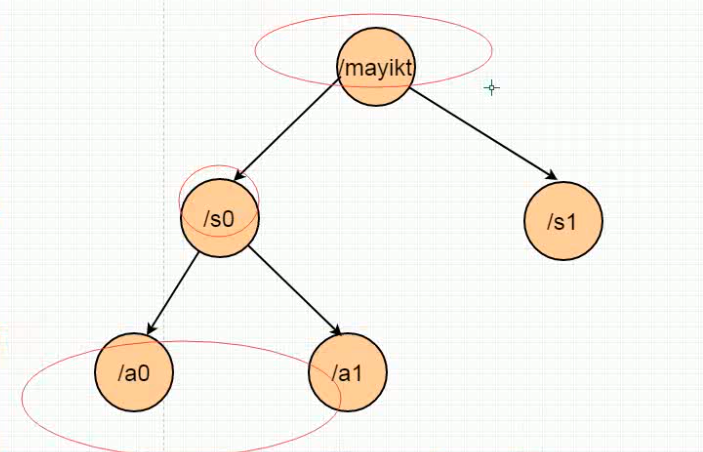
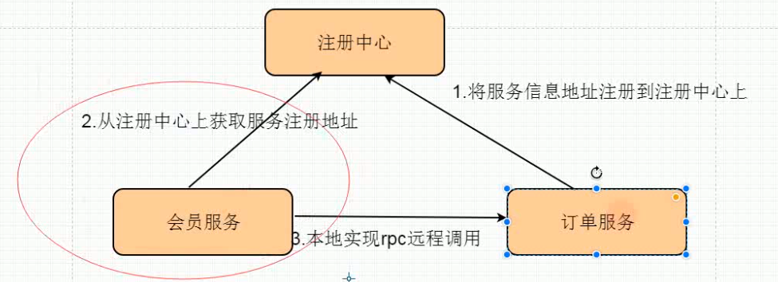

# 01.第一节-Zookeeper基础知识点回顾.mp4

zk 实现基本的总结 类似于文件系统存储 可以帮助我们解决分布式领域中遇到的问题

zk分布式协调工具

特征:

1. 定义的节点包含key(路径) 和 value,路径允许有重复, 保证唯一性
2. zk分为4种类型, 持久,持久序号,临时,临时序号
3. 持久于临时节点区别: 连接如果一旦关闭,当前的节点自动删除;
4. 事件通知: 监听节点发生的变化, 删除 ,修改,

最核心:事件通知 和 临时节点

# 02.第二节-Zookeeper实现事件监听通知.mp4





> > >9:58

监听节点,可以拿到子节点的结果

从而可以更新 服务列表



# 03.第三节-多线程情况下生成订单号码存在那些问题.mp4


# 04.第四节-Zookeeper实现分布式锁基本设计思路.mp4


# 05.第五节-使用模版方法设计模式定义共同锁骨架.mp4


# 06.第六节-Zookeeper实现分布式锁代码实现.mp4


# 07.第七节-Zookeeper效果整体演示.mp4


# 08.第八节-Zookeeper超时了，如何防止死锁问题.mp4


# 09.第九节-Zookeeper实现分布式锁事件移出.mp4


```
(.*)mp4\n

# $1mp4\n\n\n\n

```