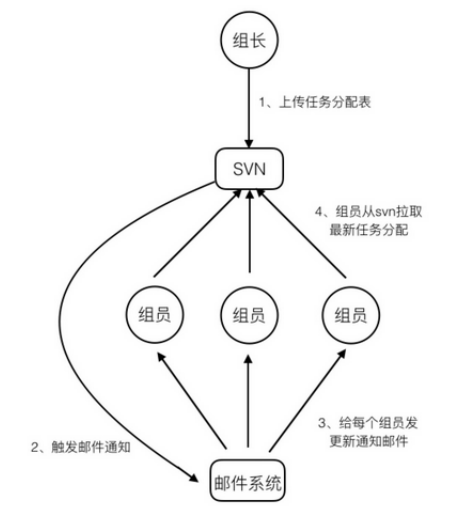

# 01.课程内容介绍.vep

# 02.Zookeeper如何解决分布式系统问题.vep

**通过⽹络进⾏信息共享** 

这就像现实中，开发leader在会上把任务传达下去，组员通过听leader命令或者看leader的邮件知道⾃ 

⼰要⼲什么。当任务分配有变化时，leader会单ᇿ告诉组员，或者再次召开会议。信息通过⼈与⼈之间 

的直接沟通，完成传递。 

**通过共享存储** 

这就好⽐开发leader按照约定的时间和路径，把任务分配表放到了svn上，组员每天去svn上拉取最新的 

任务分配表，然后⼲活。其中svn就是共享存储。更好⼀点的做法是，当svn⽂件版本更新时，触发邮件 

通知，每个组员再去拉取最新的任务分配表。这样做更好，因为每次更新，组员都能第⼀时间得到消 

息，从⽽让⾃⼰⼿中的任务分配表永远是最新的。此种⽅式依赖于中央存储。整个过程如下图所示

# 03.Zookeeper基本概念（上）.vep

**zookeeper****的基本概念** 

Zookeeper是⼀个开源的分布式协调服务，其设计⽬标是将那些复杂的且容易出错的分布式⼀致性服务 

封装起来，构成⼀个⾼效可靠的原语集，并以⼀些简单的接⼝提供给⽤户使⽤。zookeeper是⼀个典型 

的分布式数据⼀致性的解决⽅案，分布式应⽤程序可以基于它实现诸如数据订阅/发布、负载均衡、命名 

服务、集群管理、分布式锁和分布式队列等功能

**基本概念** 

① **集群⻆⾊** 

通常在分布式系统中，构成⼀个集群的每⼀台机器都有⾃⼰的⻆⾊，最典型的集群就是Master/Slave模 

式（主备模式），此情况下把所有能够处理写操作的机器称为Master机器，把所有通过异步复制⽅式获 

取最新数据，并提供读服务的机器为Slave机器。 

⽽在Zookeeper中，这些概念被颠覆了。它没有沿⽤传递的Master/Slave概念，⽽是引⼊了Leader、 

Follower、Observer三种⻆⾊。Zookeeper集群中的所有机器通过Leader选举来选定⼀台被称为 

Leader的机器，Leader服务器为客户端提供读和写服务，除Leader外，其他机器包括Follower和 

Observer,Follower和Observer都能提供读服务，唯⼀的区别在于**Observer****不参与****Leader****选举过程**， 

**不参与写操作**的**过半写成功**策略，因此Observer可以在不影响写性能的情况下提升集群的性能。

# 04.Zookeeper基本概念（下）.vep

# 05.Zookeeper单机模式环境的搭建.vep

# 06.Zookeeper伪集群模式环境的搭建.vep

# 07.Zookeeper系统模型之ZNode.vep

# 08.Zookeeper系统模型之Watcher.vep

# 09.Zookeeper系统模型之ACL.vep

# 10.使用命令行创建节点.vep

# 11.使用命令行读取节点.vep

# 12.使用命令行更新和删除节点.vep

# 13.使用API建立会话.vep

# 14.使用API创建节点.vep

# 15.使用API获取节点信息.vep

# 16.使用API更新节点.vep

# 17.使用API删除节点.vep

# 18.使用ZkClient建立会话.vep

# 19.使用ZkClient创建和删除节点.vep

# 20.使用ZkClient获取子节点.vep

# 21.其他ZkClient操作.vep

# 22.使用Curator建立会话.vep

# 23.使用Curator创建节点.vep

# 24.使用Curator删除节点.vep

# 25.使用Curator获取节点信息.vep

# 26.使用Curator更新节点.vep