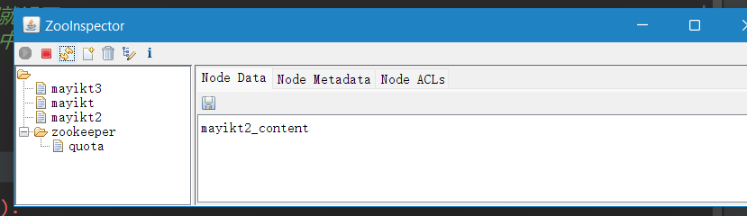

# 01.基于Zookeeper实现动态负载均衡课程介绍.mp4


# 02.Zookeeper实际案例中的应用场景.mp4

zk - 分布式领域中的协调者

zk应用场景 ：

1. 分布式锁 （redis或者zk）
2. Dubbo服务注册（zk）
3. 分布式配置中心 disconfig（百度的一个框架， 它吧它的配置信息放到了zk上了）
4. 分布式消息中间件
5. 发布订阅（事件通知）
6. Master 选举（zk节点是唯一的）


zk之所以能够帮我们解决这些问题，是离不开zk的特性： 

Zookeeper的特性： 类似文件系统

/

/mayikt/

/mayitk/s0

---


·分布式Zookeeper快速入门
.什么是Zookeeper.
官方文档上这么解释zookeeper，它是一个分布式服务框架，是Apache Hadoop 的一个子项目，它主要是用来解决分布式应用中经常遇到的一些数据管理问题，如:统一命名服务、状态同步服务、集群管理、分布式应用配置项的管理等。+
上面的解释有点抽象，简单来说zookeeper=文件系统+监听通知机制

# 03.Zookeeper基本的实现的特征.mp4

。


---

基本特性: 

定义的节点包含节点名称和节点内容

,定义的节点名称是不允许有重复的;

每个节点都可以设置对应的值

最重要的特性: 节点的路径不允许重复,否则就违反了幂等性原则了

**事件通知**

最后总结zk特征:

1. 节点名称和节点value，路径必须保证是唯一，不允许重复。
2. 每个节点都会有事件通知，当节点发生任何变化都可以获取信息;


# 04.基于linux环境安装Zookeeper.mp4

## ***\*Z\*******\*ookeeper\*******\*单机\*******\*版本\****

### ***\*L\*******\*inux\*******\*环境\*******\*安装Zookeeper\****

1.解压zk压缩包

tar -zxvf zookeeper-3.4.14.tar.gz

 

\2. 进入到zk目录

cd zookeeper-3.4.14

 

3.在zk目录中创建data和logs文件夹

mkdir data

mkdir logs

 

4.进入到conf目录，修改文件名称

mv zoo_sample.cfg zoo.cfg

vi zoo.cfg

 

dataDir =/usr/local/zookeeper-3.4.14/data

dataLogDir=/usr/local/zookeeper-3.4.14/logs

5.启动zk

./zkServer.sh start

./zkServer.sh status


单机启动成功


# ***\*核心相关\*******\*命令\****

service keepalived start

service keepalived stop

systemctl stop firewalld

 

---


zk 的工具

 

注意：在安装Zk的时候提前安装好jdk环境 建议java8以上

# 05.注意安装Zookeeper前安装Jdk环境.mp4

要安装jdk环境,配置环境变量

否则会报错


# 06.Java语言客户端连接Zookeeper.mp4


---


```java
package com.mayikt.zk;

import org.apache.zookeeper.*;

import java.io.IOException;

/**
 * ClassName: Test001 <br/>
 * Description: Test001 <br/>
 * Date: 2021-07-01 15:58 <br/>
 * <br/>
 *
 * @author yufengming
 * @version 产品版本信息 2021-07-01 15:58 yufengming(victorefengming.gitee.io) 新建<br/>
 * @project mayikt_zk
 * @package com.mayikt.zk
 * @email victorfengming@163.com
 * <p>
 * 修改记录
 */
public class Test001 {
//             * 参数1. 链接地址

    private static final String ADDRES = "116.62.194.162:2181";
//         * 参数2. zk超时事件
        private static final int TIMEOUT = 5000;

//         * 参数3. 事件通知
//
    public static void main(String[] args) throws IOException, KeeperException, InterruptedException {
        // zk 核心节点 + 事件通知
        // 节点路径 和节点 value
        /**
         * 参数1. 链接地址
         * 参数2. zk超时事件
         * 参数3. 事件通知
         */

        // 1. 创建 zk链接
        ZooKeeper zooKeeper = new ZooKeeper(ADDRES, TIMEOUT, new Watcher() {
            @Override
            public void process(WatchedEvent watchedEvent) {
                Event.KeeperState state = watchedEvent.getState();
                if (state == Event.KeeperState.SyncConnected) {
                    System.out.println("链接成功!!!");
                }
            }
        });

        // 创建我门的节点
        // 参数1 路径名称
        // 参数2 节点value
        // 参数3. 节点权限 acl        OPEN_ACL_UNSAFE 开放权限
        // 参数4 节点类型 临时和永久
        String s = zooKeeper.create("/mayikt", "mayikt".getBytes(), ZooDefs.Ids.OPEN_ACL_UNSAFE, CreateMode.PERSISTENT);
        System.out.println(s);

        //
        
    }
}

```

这里可以利用java8新特性,来利用lambda表达式进行改进


运行


# 07.Countdown计算器优化ZK代码.mp4

之前的写法有bug

举个例子:如果我zk没有链接成功

那么

就

就

后面就报错了

```java
package com.mayikt.zk;

import org.apache.zookeeper.*;

import java.io.IOException;
import java.util.concurrent.CountDownLatch;

/**
 * ClassName: Test001 <br/>
 * Description: Test001 <br/>
 * Date: 2021-07-01 15:58 <br/>
 * <br/>
 *
 * @author yufengming
 * @version 产品版本信息 2021-07-01 15:58 yufengming(victorefengming.gitee.io) 新建<br/>
 * @project mayikt_zk
 * @package com.mayikt.zk
 * @email victorfengming@163.com
 * <p>
 * 修改记录
 */
public class Test001 {
    //         * 参数1. 链接地址

    private static final String ADDRES = "116.62.194.162:2181";
    //         * 参数2. zk超时事件
    private static final int TIMEOUT = 5000;

    //         * 参数3. 事件通知
//

    // countDownLatch计数器
    private static CountDownLatch countDownLatch = new CountDownLatch(1);
    public static void main(String[] args) throws IOException, KeeperException, InterruptedException {
        // zk 核心节点 + 事件通知
        // 节点路径 和节点 value
        /**
         * 参数1. 链接地址
         * 参数2. zk超时事件
         * 参数3. 事件通知
         */

        // 1. 创建 zk链接
        ZooKeeper zooKeeper = new ZooKeeper(ADDRES, TIMEOUT, new Watcher() {
            @Override
            public void process(WatchedEvent watchedEvent) {
                Event.KeeperState state = watchedEvent.getState();
                if (state == Event.KeeperState.SyncConnected) {
                    System.out.println("zk链接成功!!!");
                                        // 计数器减一
                    countDownLatch.countDown();
                }
            }
        });

        System.out.println("zk 正在链接等待...");
        // 计数器 结果必须为0 才能继续执行
        countDownLatch.await();
        System.out.println("开始创建节点");
        // 2. 创建我门的节点
        // 参数1 路径名称
        // 参数2 节点value
        // 参数3. 节点权限 acl        OPEN_ACL_UNSAFE 开放权限
        // 参数4 节点类型 临时和永久
        String s = zooKeeper.create("/mayikt2", "mayikt2_content".getBytes(), ZooDefs.Ids.OPEN_ACL_UNSAFE, CreateMode.PERSISTENT);
        System.out.println(s);

        //

    }
}

```


# 08.Zookeeper四种节点类型.mp4


```java
String s = zooKeeper.create("/mayikt3", "mayikt3_content".getBytes(), ZooDefs.Ids.OPEN_ACL_UNSAFE, CreateMode.EPHEMERAL);
```


```cmd
zk 正在链接等待...
zk链接成功!!!
开始创建节点
/mayikt3

Process finished with exit code 0
```


会发现 - 创建完了没有 节点数据 ,

就离谱

因为我这个会话已经关闭了

你如果有想要看到效果你可以搞一个等待

```java
        Thread.sleep(5000);
```




就能看到一瞬间

然后就


```java
        /**
         * zk 节点分为4种类型
         * 1. 临时节点 - 会话关闭就没了 CreateMode.EPHEMERAL
         * 2. 持久节点 - 存到硬盘中,它不没 CreateMode.PERSISTENT
         * 3. 临时有序号节点 CreateMode.EPHEMERAL_SEQUENTIAL
         * 4. 持久有序号节点 CreateMode.PERSISTENT_SEQUENTIAL
         */
```

---

不能直接创建 多级别 节点

```java
String s = zooKeeper.create("/victor/s1", "content1".getBytes(), ZooDefs.Ids.OPEN_ACL_UNSAFE, CreateMode.PERSISTENT_SEQUENTIAL);
        System.out.println(s);
```


```shell
zk 正在链接等待...
zk链接成功!!!
开始创建节点
Exception in thread "main" org.apache.zookeeper.KeeperException$NoNodeException: KeeperErrorCode = NoNode for /victor/s1
	at org.apache.zookeeper.KeeperException.create(KeeperException.java:111)
	at org.apache.zookeeper.KeeperException.create(KeeperException.java:51)
	at org.apache.zookeeper.ZooKeeper.create(ZooKeeper.java:783)
	at com.mayikt.zk.Test001.main(Test001.java:68)

Process finished with exit code 1

```

---

acl权限

我们之前创建的 权限 是都可以访问的


---

# 09.Zookeeper节点ACL权限控制.mp4

```java
package com.mayikt.zk;

import org.apache.zookeeper.*;
import org.apache.zookeeper.data.ACL;
import org.apache.zookeeper.data.Id;
import org.apache.zookeeper.server.auth.DigestAuthenticationProvider;

import java.io.IOException;
import java.security.NoSuchAlgorithmException;
import java.util.ArrayList;
import java.util.concurrent.CountDownLatch;

/**
 * ClassName: Test001 <br/>
 * Description: Test001 <br/>
 * Date: 2021-07-01 15:58 <br/>
 * <br/>
 *
 * @author yufengming
 * @version 产品版本信息 2021-07-01 15:58 yufengming(victorefengming.gitee.io) 新建<br/>
 * @project mayikt_zk
 * @package com.mayikt.zk
 * @email victorfengming@163.com
 * <p>
 * 修改记录
 */
public class Test002 {
    //         * 参数1. 链接地址

    private static final String ADDRES = "116.62.194.162:2181";
    //         * 参数2. zk超时事件
    private static final int TIMEOUT = 5000;

    //         * 参数3. 事件通知

    // countDownLatch计数器
    private static CountDownLatch countDownLatch = new CountDownLatch(1);

    public static void main(String[] args) throws IOException, KeeperException, InterruptedException, NoSuchAlgorithmException {
        // zk 核心节点 + 事件通知
        // 节点路径 和节点 value
        /**
         * 参数1. 链接地址
         * 参数2. zk超时事件
         * 参数3. 事件通知
         */

        // 1. 创建 zk链接
        ZooKeeper zooKeeper = new ZooKeeper(ADDRES, TIMEOUT, new Watcher() {
            @Override
            public void process(WatchedEvent watchedEvent) {
                Event.KeeperState state = watchedEvent.getState();
                if (state == Event.KeeperState.SyncConnected) {
                    System.out.println("zk链接成功!!!");
                    // 计数器减一
                    countDownLatch.countDown();
                }
            }
        });

        System.out.println("zk 正在链接等待...");
        // 计数器 结果必须为0 才能继续执行
        countDownLatch.await();
        System.out.println("开始创建节点");

        // 1.2 .创建账号权限 admin可以实现读写操作
        Id id1 = new Id("digest", DigestAuthenticationProvider.generateDigest("admin:admin123"));
        ACL acl1 = new ACL(ZooDefs.Perms.ALL, id1);

// 3.创建权限guest 只允许做读操作
        Id id2 = new Id("digest", DigestAuthenticationProvider.generateDigest("guest:guest123"));
        ACL acl2 = new ACL(ZooDefs.Perms.READ, id2);


        // 4.添加该账号
        ArrayList<ACL> aces = new ArrayList<ACL>();
        aces.add(acl1);
        aces.add(acl2);


        // 2. 创建我门的节点
        // 参数1 路径名称
        // 参数2 节点value
        // 参数3. 节点权限 acl        OPEN_ACL_UNSAFE 开放权限
        // 参数4 节点类型 临时和永久

        String s = zooKeeper.create("/meite", "content".getBytes(), aces, CreateMode.PERSISTENT);
        System.out.println(s);


    }
}

```


但是 meite下面没有值,因为没有权限查看


# 10.使用Zookeeper实现服务注册.mp4


# 11.使用Zookeeper实现服务发现.mp4