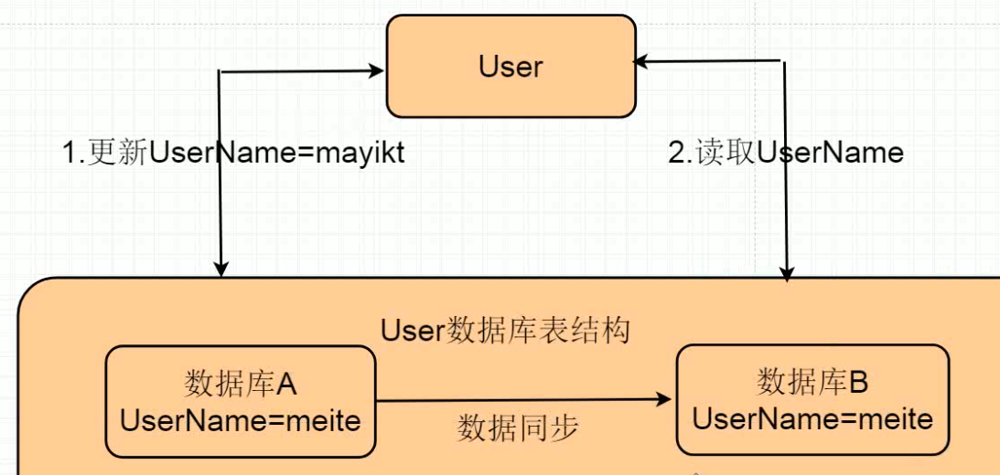

# 01.Zookeeper集群选举效果演示.mp4

zk集群 

1. 强制一致性,弱一致性,最终一致性 概念
2. 分区容错CAP概念,为什么不能三者全部兼容
3. zk一致性zab协议底层原理
4. 为什么zk集群节点一定要是奇数

> zk集群节点最好是奇数, 基本规则,剩余节点的总数大于(n) 集群节点总数/2 ,zk才可以正常运行

n = 3,宕机了1台,整个集群可以运行

# 02.分布式理论强一致性概念.mp4

mysql集群 表结构都相同

强一致性概念: 也就是步骤1修改了userName为mayitk,布置一定读取到结果也是为mayitk;

实现方式: mysql主从复制 非常迅速同步或者是使用锁机制必须等待mysql1数据同步到mysql2 这时候才可以读取

# 03.分布式理论最终一致性概念.mp4

注意: 在分布式中不可能保证强一致性

弱一致性: 也就是步骤1修改了 userName 为 mayikt,允许步骤2 读取时候 还是原来数据;

最终一致性: 在弱一致性的情况下进行优化,允许步骤2进行脏堵,最终要进行同步(重试/人工补偿)

# 04.生活案例实际讲解一致性原理.mp4

超过一半的反馈

原理: 投票过半机制,zk选举策略领导就采用过半机制

预提交（你们是否听懂>?）等待你们回复过半的学员都听懂的话执行下一步流程
2pc两阶段提交协议;
I
过程中存在:预提交、接受回复执行请求类似2PC两阶段提交过半机制

# 05.Zookeeper集群选举原理策略.mp4

04:19

# 06.构建Zookeeper集群环境01.mp4

# 07.构建Zookeeper集群环境02.mp4

# 08.为什么Zookeeper集群节点一定要是奇数.mp4

